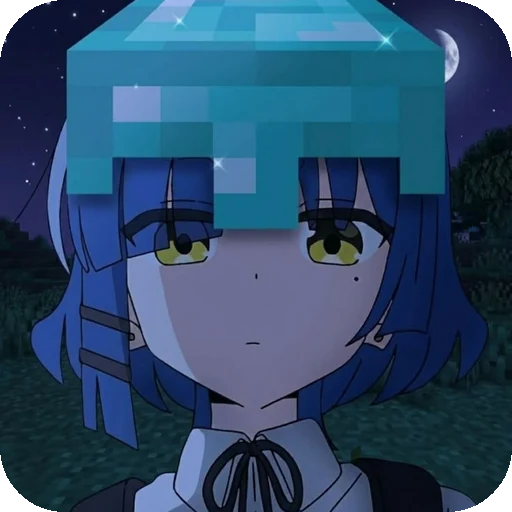

 

 

Salah satu hal yang aku kerjakan adalah **Kyora** — aplikasi stream anime sub Indo untuk Android. 
Aku suka membuat tampilan yang tenang, rapi, dan enak dipakai sehari-hari.

<table>
<tr>
<td width="34%" valign="middle" align="center">

</td>
<td width="66%" valign="middle">

### Proyek — Kyora

**Stream anime sub Indo untuk Android.** Ringan, cepat, dan rapi.

  

</td>
</tr>
</table>

<table>
<tr>
<td align="center" width="25%"><b>Beranda</b> Populer bergiliran dan chip genre</td>
<td align="center" width="25%"><b>Streaming</b> Resolusi, kecepatan subtitle, layar penuh</td>
<td align="center" width="25%"><b>Koleksi</b> Bookmark dan riwayat yang ikut akun</td>
<td align="center" width="25%"><b>Komentar</b> Diskusi tiap episode, balasan bertingkat</td>
</tr>
</table>

### Perkakas

 

### Tautan

